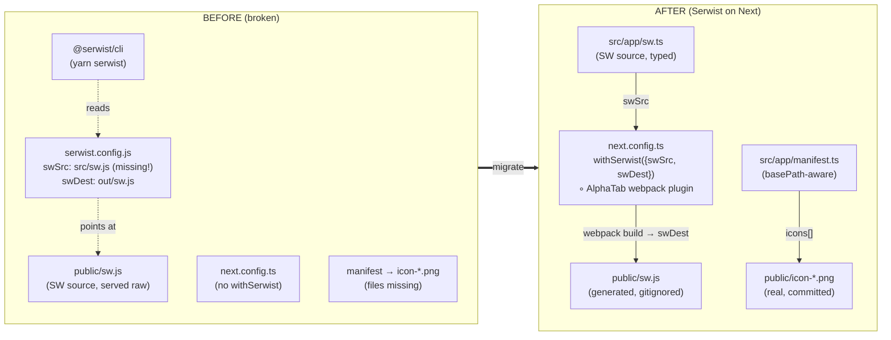
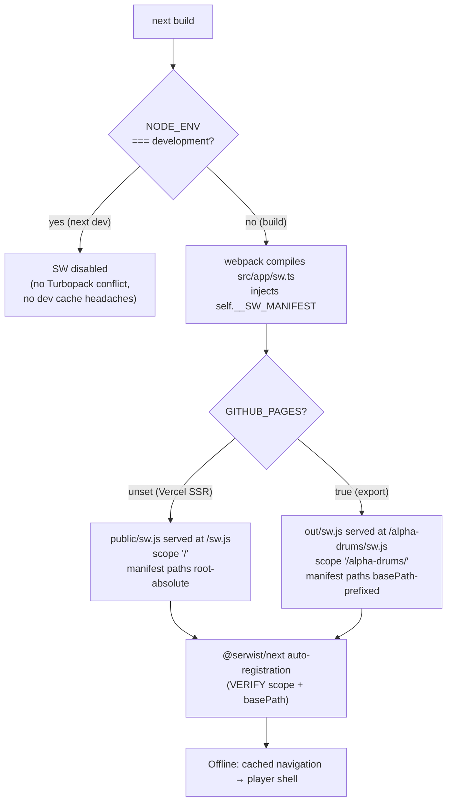

# feat: Installable, offline-capable PWA on Vercel SSR + GitHub Pages export

## Summary

Make Alpha Drums an installable, offline-capable PWA on the Vercel SSR build (`next build`) without breaking the GitHub Pages static export (`GITHUB_PAGES=true next build` → `output: 'export'`). Standardize the service-worker (SW) toolchain on **`@serwist/next` (`withSerwist`)** and remove the broken, half-migrated `@serwist/cli` wiring. Fix the manifest (missing icons, basePath-correct paths, maskable + apple-touch icons) so the install prompt actually appears on iOS and Android.

The current PWA setup is non-functional: `public/sw.js` is an un-bundled SW *source* served raw, `serwist.config.js` points at a non-existent `src/sw.js` and the GH-Pages-only `out/` dir, `next.config.ts` never wraps `withSerwist`, there is no SW registration, and the manifest references **three icon files that do not exist in `public/`**.

---

## Problem Frame

**Where we are.** The app deploys to Vercel as SSR (`output: undefined`) and to GitHub Pages as a static export (`output: 'export'`) under basePath `/alpha-drums`. PWA support was only ever partially wired for the GH Pages export and is now broken:

- `public/sw.js` imports `@serwist/next/worker` and uses `self.__SW_MANIFEST` — it is a **worker source**, but it sits in `public/` where it is served verbatim and un-bundled; nothing processes `self.__SW_MANIFEST`, so it cannot run.
- `serwist.config.js` (the `@serwist/cli` config) sets `swSrc: 'src/sw.js'` (**does not exist**), `swDest: 'out/sw.js'`, `globDirectory: 'out'` — bound to the GH Pages export dir and broken everywhere else.
- `next.config.ts` does **not** wrap `withSerwist`; it has a custom AlphaTab webpack plugin that must be preserved.
- There is **no** client-side SW registration anywhere in `src/`.
- `package.json` carries **both** `@serwist/cli` and `@serwist/next`; scripts `serwist` / `serwist:dev`; and the `deploy` script runs `yarn serwist` after build, which would fail (no `src/sw.js`).
- `public/manifest.webmanifest` references `/icon-192.png`, `/icon-512.png`, `/apple-touch-icon.png` — **none of these files exist** in `public/`. There is only `src/app/favicon.ico` and Next-default SVGs. Installability is therefore impossible today.

**Where we want to be.** A single, coherent Serwist-on-Next pipeline that:
1. Produces a working, registered SW on the Vercel production build.
2. Makes the app installable on iOS + Android (valid manifest, real icons, maskable + apple-touch).
3. Caches the player shell for offline use without bloating the precache with large AlphaTab soundfonts/fonts.
4. Still produces a working SW + correct basePath manifest/icons for the `GITHUB_PAGES=true` export.

**Done =** SW registers on the Vercel production URL; installable on iOS + Android (Lighthouse PWA installability passes); offline loads the player shell; GitHub Pages export still builds with a basePath-correct SW + manifest; all CI green.

---

## Requirements

- **R1 — Single SW toolchain.** Standardize on `@serwist/next` (`withSerwist`). Remove `@serwist/cli`, `serwist.config.js`, the `serwist` / `serwist:dev` scripts, and the `yarn serwist` step in `deploy`.
- **R2 — SW source relocated + bundled.** Move the SW source to `src/app/sw.ts` (reusing the config currently in `public/sw.js`), compiled by `withSerwist` (`swSrc: 'src/app/sw.ts'`, `swDest: 'public/sw.js'`).
- **R3 — Preserve AlphaTab webpack plugin.** Composing `withSerwist` must not drop the existing `AlphaTabWebPackPlugin` wiring or the `.mjs` rule in `next.config.ts`.
- **R4 — Installable manifest + icons.** Provide real 192 / 512 icons (`purpose: any`), maskable variants, an apple-touch-icon, `theme_color`, `background_color`, `display: standalone`. The currently-referenced-but-missing icons must exist.
- **R5 — basePath correctness.** SW scope/registration, the manifest link, and all manifest/icon URLs must respect the `/alpha-drums` basePath under `GITHUB_PAGES=true`, and be root-absolute (`/...`) on Vercel.
- **R6 — Both builds work.** `next dev`, `next build` (SSR), and `GITHUB_PAGES=true next build` (export) all complete; the export still emits a usable SW.
- **R7 — No precache bloat.** AlphaTab soundfonts (`public/soundfont/*.sf2|sf3`, ~1.3 MB + ~954 KB) and Bravura fonts (`public/font/*`, ~2.6 MB) must not be force-precached; use a sensible `maximumFileSizeToCacheInBytes` and rely on runtime caching for large assets.
- **R8 — Offline shell.** With the SW active, loading the app offline serves the player shell (cached navigation), not a browser error page.
- **R9 — CI / quality gates.** Conventional commits, husky pre-commit (`lint-staged` → eslint + prettier) pass; never `--no-verify`; existing Jest suite stays green.

---

## High-Level Technical Design

### Toolchain: before → after



### SW build + registration flow (per deploy target)



> Directional. Prose and per-unit detail below are authoritative where they disagree.

---

## Key Technical Decisions

### KTD1 — Standardize on `@serwist/next`, drop `@serwist/cli`
`@serwist/next` is the maintained App-Router-native successor to `next-pwa`; it compiles the SW through Next's own webpack pass, so one pipeline serves both the SSR build and the `output: 'export'` build. `@serwist/cli` (manifest-inject CLI) is redundant here, is currently misconfigured, and binds the SW to the GH-Pages `out/` dir. **Decision:** remove `@serwist/cli`, `serwist.config.js`, both `serwist*` scripts, and the `deploy` `yarn serwist` step; keep `@serwist/next` + `serwist` (the core lib `src/app/sw.ts` imports).

### KTD2 — Disable the SW in development
Set `disable: process.env.NODE_ENV === 'development'` in the `withSerwist` options. This sidesteps the Turbopack/webpack concern entirely (the SW is only compiled in production builds, which use webpack regardless), avoids dev-time stale-cache confusion, and means PWA behavior is verified via `next build && next start` locally and on Vercel previews. `next dev` still runs — it simply serves no SW. *(Confirmed: `dev`/`build` scripts pass no `--turbopack` flag, so production builds are webpack.)*

### KTD3 — SW source at `src/app/sw.ts`, typed in-file, excluded from app `tsc`
Reuse the existing worker body (`defaultCache`, `skipWaiting`, `clientsClaim`, `navigationPreload`, `runtimeCaching`). Type it with in-file directives — `/// <reference lib="webworker" />`, a `declare global` for `__SW_MANIFEST`, and `declare const self: ServiceWorkerGlobalScope` — and **add `src/app/sw.ts` to `tsconfig.json` `exclude`** so the app's global `tsc` pass does not pull the `webworker` lib (which would collide with the app's `dom` `self`/`Window` typing). Serwist compiles `sw.ts` independently with the correct libs. *(Alternative — add `webworker` to global `lib` + `@serwist/next/typings` to `types` — risks app-wide `self` type conflicts; rejected as higher-risk.)*

### KTD4 — basePath-aware manifest via `src/app/manifest.ts`
Replace the static `public/manifest.webmanifest` with a dynamic `src/app/manifest.ts` (`MetadataRoute.Manifest`) that prefixes every `src` / `start_url` / `scope` with `getBasePath()` (already exists in `src/lib/utils.ts`, reads `NEXT_PUBLIC_BASE_PATH`). On Vercel `getBasePath()` is `''` (root-absolute); on GH Pages it is `/alpha-drums`. Next renders this to a static `manifest.webmanifest` during both SSR build and export — one source, correct paths per deploy. **Verify** the auto-injected `<link rel="manifest">` href carries basePath in the export; if Next omits it (it historically has under `output: 'export'`, which is why the manifest link is hand-rolled with `getAssetPath` today), keep an explicit `metadata.manifest = getAssetPath('/manifest.webmanifest')` and ensure only one manifest link is emitted.

### KTD5 — Icons generated with ImageMagick, committed as static assets
No brand raster asset exists and `sharp` is not installed, but `magick` (ImageMagick) is available. Author a source `public/icon.svg` (simple Alpha Drums motif on a dark themed background) and a reproducible `scripts/generate-icons.mjs` that rasterizes it to `icon-192.png`, `icon-512.png` (purpose `any`), `icon-192-maskable.png`, `icon-512-maskable.png` (purpose `maskable`, ~12% safe-zone padding), and `apple-touch-icon.png` (180×180, opaque background — iOS does not mask). PNGs are committed to `public/`; the script is kept for regeneration but is **not** wired into the build.

### KTD6 — Keep large assets out of the precache (R7)
The default precache globs Next build output, not arbitrary `public/` files, so the ~1.3 MB/954 KB soundfonts and ~2.6 MB Bravura fonts are not precached by default. Belt-and-suspenders: set `maximumFileSizeToCacheInBytes` to a conservative limit (≈4 MB) and rely on `defaultCache` runtime caching (`@serwist/next/worker`) for on-demand fetches of soundfonts/fonts/workers. The offline guarantee (R8) is the player **shell**, not the full audio engine assets.

---

## Assumptions

- `@serwist/next` auto-registers the SW (injects a registration script) and honors Next `basePath` for the SW URL + scope. **U6 verifies this in the export build**; if registration is missing or basePath-incorrect, U6's fallback adds an explicit client registration (`src/components/ServiceWorkerRegister.tsx` using `getAssetPath('/sw.js')` + scope `getBasePath() + '/'`).
- `next dev` / `next build` use webpack (no `--turbopack` flag present), so `@serwist/next`'s webpack integration applies cleanly.
- The effective lint pass is the lenient flat config (`eslint.config.mjs` → `next/core-web-vitals` + `next/typescript`); ESLint 9 ignores the legacy strict `.eslintrc.json` when a flat config is present. New files must still pass `next lint` + prettier. *(Verify `lint-staged.config.js` scope during execution.)*
- `output: 'export'` supports `app/manifest.ts` and `@serwist/next` SW compilation (both emit into `out/`). U6 verifies the emitted `out/sw.js` and `out/manifest.webmanifest`.

---

## Output Structure

New/changed files (repo-relative):

```text
next.config.ts                 # MODIFY: wrap withSerwist, keep AlphaTab plugin
tsconfig.json                  # MODIFY: exclude src/app/sw.ts
package.json                   # MODIFY: drop @serwist/cli + serwist scripts, fix deploy
.gitignore                     # MODIFY: ignore generated SW
serwist.config.js              # DELETE
public/sw.js                   # DELETE (old source) → regenerated as build artifact (gitignored)
public/manifest.webmanifest    # DELETE → replaced by src/app/manifest.ts
src/app/sw.ts                  # NEW: service worker source
src/app/manifest.ts            # NEW: basePath-aware web manifest
src/app/layout.tsx             # MODIFY: viewport themeColor, basePath icons/apple-touch
src/app/manifest.test.ts       # NEW: unit test for basePath prefixing
public/icon.svg                # NEW: icon source
public/icon-192.png            # NEW (generated, committed)
public/icon-512.png            # NEW (generated, committed)
public/icon-192-maskable.png   # NEW (generated, committed)
public/icon-512-maskable.png   # NEW (generated, committed)
public/apple-touch-icon.png    # NEW (generated, committed)
scripts/generate-icons.mjs     # NEW: reproducible icon generation
```

---

## Implementation Units

### U1. Remove `@serwist/cli` wiring and broken artifacts

**Goal:** Eliminate the dead/broken `@serwist/cli` pipeline so only `@serwist/next` remains.
**Requirements:** R1.
**Dependencies:** none.
**Files:**
- `serwist.config.js` (delete)
- `public/sw.js` (delete — old misplaced source; the generated one comes back via U3, gitignored in U6)
- `package.json` (modify: remove `serwist` + `serwist:dev` scripts; change `deploy` to drop `&& yarn serwist`; remove `@serwist/cli` from `devDependencies`)

**Approach:** `deploy` becomes `GITHUB_PAGES=true NEXT_PUBLIC_BASE_PATH=/alpha-drums yarn build && gh-pages -d out` (the SW is now produced by `withSerwist` during `yarn build`, so no separate inject step). Keep `@serwist/next` and `serwist` deps.
**Patterns to follow:** existing `package.json` script style.
**Test scenarios:** `Test expectation: none — dependency/config removal; correctness proven by the build verification in U6.`
**Verification:** `serwist.config.js` and `public/sw.js` gone; `grep -r "@serwist/cli\|yarn serwist" package.json` returns nothing; `yarn install` succeeds.

### U2. Add the service-worker source at `src/app/sw.ts`

**Goal:** A typed, bundler-processed SW source replacing the raw `public/sw.js`.
**Requirements:** R2.
**Dependencies:** U1.
**Files:**
- `src/app/sw.ts` (new)
- `tsconfig.json` (modify: add `src/app/sw.ts` to `exclude`)

**Approach:** Port the worker body from the old `public/sw.js` (`new Serwist({ precacheEntries: self.__SW_MANIFEST, skipWaiting: true, clientsClaim: true, navigationPreload: true, runtimeCaching: defaultCache })` + `addEventListeners()`). Add in-file typing per KTD3 so the app `tsc` pass is untouched.
**Patterns to follow:** the canonical `@serwist/next` `app/sw.ts` template; existing import style.
**Technical design (directional):**
```ts
/// <reference lib="webworker" />
import { defaultCache } from "@serwist/next/worker";
import { type PrecacheEntry, type SerwistGlobalConfig, Serwist } from "serwist";

declare global {
  interface WorkerGlobalScope extends SerwistGlobalConfig {
    __SW_MANIFEST: (PrecacheEntry | string)[] | undefined;
  }
}
declare const self: ServiceWorkerGlobalScope;

const serwist = new Serwist({
  precacheEntries: self.__SW_MANIFEST,
  skipWaiting: true,
  clientsClaim: true,
  navigationPreload: true,
  runtimeCaching: defaultCache,
});
serwist.addEventListeners();
```
**Test scenarios:** `Test expectation: none — SW module is exercised by the build (U3) and runtime offline check (U6), not unit tests.`
**Verification:** file compiles inside the Serwist webpack pass during U3's build; app `tsc --noEmit` unaffected (no new `webworker`/`dom` conflicts).

### U3. Wrap `next.config.ts` with `withSerwist`, preserving the AlphaTab plugin

**Goal:** Compile + emit the SW through Next's build while keeping all existing webpack customizations.
**Requirements:** R2, R3, R6, R7.
**Dependencies:** U2.
**Files:** `next.config.ts` (modify)

**Approach:** Import `withSerwistInit from '@serwist/next'`; build `withSerwist` with `{ swSrc: 'src/app/sw.ts', swDest: 'public/sw.js', cacheOnNavigation: true, reloadOnOnline: true, disable: process.env.NODE_ENV === 'development', maximumFileSizeToCacheInBytes: 4 * 1024 * 1024 }`; `export default withSerwist(nextConfig)`. The existing `nextConfig` object — including the `webpack(config, ...)` function with `AlphaTabWebPackPlugin` and the `.mjs` rule, plus `output`, `basePath`, `assetPrefix`, `images`, `env` — is passed through unchanged. Verify the AlphaTab plugin still loads (composition must not shadow the `webpack` key).
**Patterns to follow:** current `next.config.ts` structure; `@serwist/next` wrapper docs.
**Test scenarios:** `Test expectation: none — config change; verified by builds in U6.`
**Verification:** `next build` completes and emits `public/sw.js`; AlphaTab workers/worklets still resolve (no regression in the existing player); `next dev` starts (SW disabled).

### U4. Generate PWA icons + reproducible asset pipeline

**Goal:** Provide the real icon files the manifest needs (currently missing) for installability.
**Requirements:** R4.
**Dependencies:** none (can run parallel to U1–U3).
**Files:**
- `public/icon.svg` (new — source)
- `scripts/generate-icons.mjs` (new — ImageMagick driver)
- `public/icon-192.png`, `public/icon-512.png` (new — purpose `any`)
- `public/icon-192-maskable.png`, `public/icon-512-maskable.png` (new — purpose `maskable`, padded safe zone)
- `public/apple-touch-icon.png` (new — 180×180, opaque)

**Approach:** Author a clean SVG (Alpha Drums motif/monogram on a dark themed background matching `theme_color`). `scripts/generate-icons.mjs` shells out to `magick` (per KTD5) to rasterize each target size; maskable variants composite the motif onto a full-bleed background with ~12% padding; apple-touch-icon is flattened onto an opaque background (no alpha). Run once, commit the PNGs.
**Patterns to follow:** `scripts/copy-alphatab-assets.js` (Node script style, CommonJS/ESM consistency with repo).
**Test scenarios:** `Test expectation: none — static binary assets; validated by Lighthouse installability in U6.`
**Verification:** all six files exist in `public/`; `magick identify` reports correct dimensions; maskable variants have full-bleed background; apple-touch has no transparency.

### U5. basePath-aware manifest (`src/app/manifest.ts`) + layout metadata fixes

**Goal:** A valid, installable, basePath-correct manifest, and a `layout.tsx` whose icon/theme metadata works on both deploys.
**Requirements:** R4, R5.
**Dependencies:** U4 (icon filenames), KTD4.
**Files:**
- `src/app/manifest.ts` (new)
- `public/manifest.webmanifest` (delete)
- `src/app/layout.tsx` (modify)
- `src/app/manifest.test.ts` (new)

**Approach:** `manifest.ts` returns `MetadataRoute.Manifest` with `name`, `short_name`, `description`, `display: 'standalone'`, `start_url`, `scope`, `theme_color`, `background_color`, and an `icons` array referencing the U4 files — every URL built via `getAssetPath(...)` so basePath is applied. In `layout.tsx`: move `theme-color` into a Next `export const viewport: Viewport` (replacing the raw `<meta>` child of `<html>`); set the apple-touch-icon through `metadata.icons.apple` (or a basePath-correct `<link>` via `getAssetPath`) instead of the hardcoded `/apple-touch-icon.png`; resolve the manifest-link duplication per KTD4 (prefer Next auto-injection from `manifest.ts`; if export lacks basePath on the link, keep explicit `metadata.manifest = getAssetPath('/manifest.webmanifest')` and ensure a single link).
**Patterns to follow:** existing `getAssetPath` usage in `layout.tsx`; Next 15 Metadata/Viewport API.
**Test scenarios:**
- Happy path: default export returns `display: 'standalone'`, non-empty `icons`, and `start_url`/`scope` present.
- basePath set: with `NEXT_PUBLIC_BASE_PATH='/alpha-drums'`, every icon `src`, `start_url`, and `scope` is prefixed with `/alpha-drums`.
- basePath empty: with `NEXT_PUBLIC_BASE_PATH` unset/`''`, the same fields are root-absolute (`/...`, no double slash, no `/alpha-drums`).
- Icons include at least one `purpose: 'maskable'` and one `purpose: 'any'` (or `'any'` default) entry at 192 and 512.
**Verification:** `yarn build` emits a `manifest.webmanifest` whose icon URLs resolve; `manifest.test.ts` passes under Jest.

### U6. gitignore the generated SW; verify both builds, basePath, and offline

**Goal:** Prove the end-to-end outcome on both deploy targets and keep the generated SW out of git.
**Requirements:** R5, R6, R7, R8, R9.
**Dependencies:** U1–U5.
**Files:** `.gitignore` (modify)

**Approach:** Add `public/sw.js`, `public/sw.js.map`, and `public/swe-worker-*.js` to `.gitignore` (Serwist build artifacts). Then verify:
1. **Vercel SSR:** `yarn build` → `public/sw.js` exists; `yarn start`, load app, confirm SW registers (`navigator.serviceWorker.controller`), scope `/`; Lighthouse PWA installability passes; go offline → reload → player shell loads (R8).
2. **GH Pages export:** `GITHUB_PAGES=true NEXT_PUBLIC_BASE_PATH=/alpha-drums yarn build` → `out/sw.js` and `out/manifest.webmanifest` exist; manifest icon URLs + `start_url`/`scope` carry `/alpha-drums`; SW registration URL/scope basePath-correct (serve `out/` under a `/alpha-drums/` path to confirm). If `@serwist/next` does not auto-register or basePath is wrong, add the fallback `ServiceWorkerRegister` client component (see Assumptions) and re-verify.
3. **Quality gates:** `yarn lint`, `yarn format`, `yarn test`, `yarn typecheck` all green; husky pre-commit passes without `--no-verify`.
**Patterns to follow:** existing `.gitignore` grouping/comments.
**Execution note:** verification-heavy unit — exercise a real browser (Lighthouse installability + offline reload) before claiming done, per project workflow.
**Test scenarios:**
- Covers R8: with SW active and network offline, navigating to the app serves the cached shell, not the browser offline error.
- Covers R6: both `next build` and the `GITHUB_PAGES=true` export complete with exit 0 and emit a SW.
- Covers R5: export manifest + SW registration paths are basePath-prefixed; SSR paths are root-absolute.
**Verification:** all three checklists above pass; `git status` shows no generated `public/sw.js*` staged.

---

## Risks & Mitigations

| # | Risk | Likelihood | Mitigation |
|---|------|-----------|------------|
| RK1 | `@serwist/next` auto-registration doesn't honor `/alpha-drums` basePath in the export | Medium | U6 verifies; fallback explicit `ServiceWorkerRegister` client component using `getAssetPath('/sw.js')` + scoped registration |
| RK2 | `output: 'export'` + `@serwist/next` SW/manifest emission quirks | Medium | U6 verifies `out/sw.js` + `out/manifest.webmanifest`; if export SW is unusable, gate SW to non-export builds and document GH-Pages PWA as best-effort (Vercel is the install target) |
| RK3 | Composing `withSerwist` drops the AlphaTab webpack plugin → player breaks | Low | U3 explicitly passes the existing `webpack` fn through; verify workers resolve post-build |
| RK4 | Generated `public/sw.js` accidentally committed | Medium | U6 gitignores `public/sw.js*` + `swe-worker-*`; verify `git status` clean |
| RK5 | New files fail husky lint/prettier (strict legacy `.eslintrc.json`) | Low | Flat config is the effective linter; run `yarn lint && yarn format` pre-commit; add scoped `eslint-disable` only if a rule genuinely fires on `sw.ts` |
| RK6 | Turbopack/webpack mismatch in dev | Low | `disable: NODE_ENV==='development'` (KTD2) means no SW compiled in dev; production builds are webpack |
| RK7 | Large soundfonts/fonts bloat precache → slow/failed install | Low | `maximumFileSizeToCacheInBytes` cap + runtime caching (KTD6); offline guarantee is the shell only |

---

## Alternatives Considered

- **Keep `@serwist/cli`** (status quo): rejected — broken, bound to the `out/` export dir, duplicates `@serwist/next`, requires a separate inject step in deploy.
- **`next-pwa`**: rejected — effectively unmaintained for App Router; Serwist is its successor.
- **Static `public/manifest.webmanifest` with root-absolute paths only**: rejected — manifest icons/`start_url` would 404 on GH Pages, violating R5. Dynamic `manifest.ts` (KTD4) handles both deploys from one source.
- **Add `webworker` to global tsconfig `lib`**: rejected — risks app-wide `self`/`Window` type conflicts; in-file references + `exclude` (KTD3) is lower-risk.

---

## Scope Boundaries

**In scope:** SW toolchain migration, SW source relocation, `next.config.ts` wrap, manifest + icons, basePath correctness, both-build verification, offline shell.

### Deferred to Follow-Up Work
- Playwright e2e test asserting offline behavior in CI (manual Lighthouse + offline check covers this PR; automated e2e is a follow-up).
- Advanced runtime-caching strategies tuned per asset type (soundfont stale-while-revalidate, etc.) beyond `defaultCache`.
- Install-prompt UI / "Add to Home Screen" custom affordance and update-available toast.
- Richer maskable icon art / brand design pass (this PR ships a functional placeholder-quality icon).

---

## Sources & Research

- Local: `next.config.ts`, `package.json`, `public/sw.js`, `serwist.config.js`, `src/app/layout.tsx`, `public/manifest.webmanifest`, `src/lib/utils.ts`, `tsconfig.json`, `eslint.config.mjs`, `.eslintrc.json`, `scripts/copy-alphatab-assets.js`, `.gitignore` — confirmed the broken state, the missing icons, the webpack-not-Turbopack dev/build, the lenient effective lint config, and `magick` availability.
- `@serwist/next` `withSerwist` + `app/sw.ts` conventions (maintained App-Router PWA toolchain).
